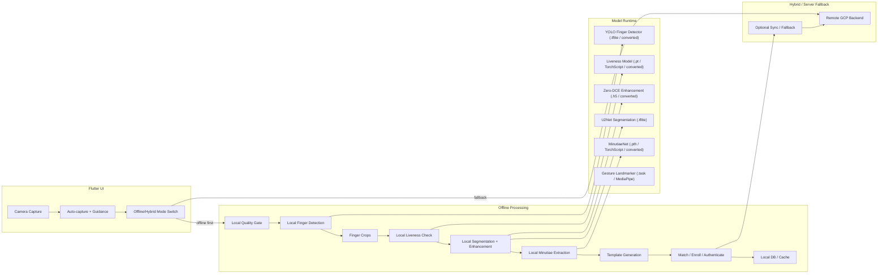

# YellowSense UIDAI — Offline Architecture & Migration Plan

## Purpose

This document defines how the current `slap_flutter_app` should transition from a GCP REST backend to a fully offline, on-device processing architecture.

## Current state

- `slap_flutter_app` is a Flutter frontend that currently depends on a remote backend.
- `lib/services/api_service.dart` sends images to the backend for all quality, slap, enrollment, authentication, verification, ROI, and liveness operations.
- The backend pipeline is implemented in `slap_app.py` and `slap_core.py`, which already contains the full local ML pipeline and model loading logic.
- Models are stored in `models/` and include both mobile-ready (`.tflite`) and desktop/server models (`.pth`, `.pt`, `.h5`).

## Offline migration objective

Transform the app into a local-first mobile solution by moving all critical pipeline stages onto the device, while preserving the current UI contract and leaving the backend as an optional hybrid fallback.

## Offline architecture overview

The offline architecture is centered around a local processing layer that can replace the current `ApiService` backend calls.

### Key components

- `Camera Capture` — existing `FingerprintCameraWidget` captures images and provides stable temp files.
- `Local Quality Gate` — on-device blur/brightness/glare and finger presence checks.
- `Local Finger Detection` — offline YOLO-based finger detection.
- `Local Liveness` — offline spoof detection.
- `Local Segmentation` — U2Net-based finger foreground extraction.
- `Local Enhancement` — Zero-DCE or fallback image enhancement.
- `Local Minutiae Extraction` — MinutiaeNet inference.
- `Local Template Generation` — ISO/minutiae template creation.
- `Local Storage` — device storage for enrolled templates, history, and offline matches.
- `Hybrid/Fallback Server` — optional remote backend when offline processing is unavailable or for sync.

## Architecture diagram

## What makes this architecture explicitly offline

- Every pipeline stage is executed locally in the `Offline Processing` section.
- The `Local Quality Gate`, `Local Finger Detection`, `Local Liveness Check`, `Local Segmentation + Enhancement`, `Local Minutiae Extraction`, and `Template Generation` blocks all happen on-device.
- The `Hybrid / Server Fallback` block is intentionally separated and optional.
- The diagram emphasizes the `offline first` path from the camera through local processing to the local DB.

## Migration plan

### Phase 1 — Verify and audit

- Confirm the exact YOLO model format used for finger detection.
- Audit which models are loaded and used today in `slap_core.py` vs which are unused.
- Identify models that must be converted for mobile inference.

### Phase 2 — Define local service interface

- Introduce a `LocalProcessingService` in Flutter.
- Keep the same method signatures as `ApiService` for:
  - `healthCheck`
  - `qualityCheck`
  - `processSlap`
  - `enrollSlap`
  - `authenticate`
  - `verify`
  - `readiness`
  - `checkRoi`
  - `livenessGesture`
- Add a configuration switch to choose between `server` and `offline` mode.

### Phase 3 — Convert models

- Convert or re-export models to mobile-compatible runtimes:
  - `best-new.pt` → TFLite/ONNX or TorchScript for detector
  - `best_f1.pth` → TorchScript or ONNX for MinutiaeNet
  - `liveness_model_v3.pt` → TorchScript or TFLite
  - `zero_dce_model.h5` → TFLite or replace with a non-model enhancement
- Keep `u2net_320x320_float32.tflite` directly.

### Phase 4 — Implement offline pipeline

- Build a local pipeline that returns the same JSON contract expected by current UI.
- Reuse camera/image pre-processing logic from `FingerprintCameraWidget`.
- Add local DB storage for enrolled templates and history.
- Implement data persistence and offline retry behavior.

### Phase 5 — Optimize and validate

- Add quantization or delegate acceleration if needed.
- Test on-device latency and memory usage.
- Verify offline results against server baseline.
- Add graceful fallback to remote GCP backend only when offline processing fails.

## Key risks and considerations

- Large model size, especially `best_f1.pth`, may challenge mobile bundle limits.
- PyTorch Mobile support in Flutter is less mature than TFLite.
- `zero_dce_model.h5` is not directly mobile-ready and likely needs conversion.
- On-device inference latency may be higher than server inference unless models are optimized.
- A hybrid approach is recommended during rollout: offline-first with remote fallback.

## Recommended next step

Implement a proof-of-concept offline service for `qualityCheck` and `processSlap` first, then expand into full enrollment/authenticate flow.

---

*Generated for `slap_flutter_app` offline transformation planning.*
